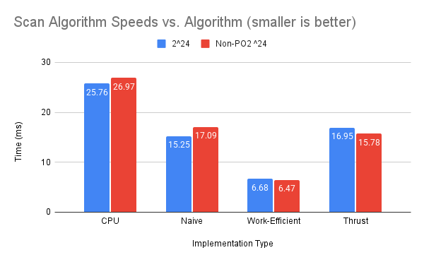

CUDA Stream Compaction
======================

**University of Pennsylvania, CIS 565: GPU Programming and Architecture, Project 2**

* Caroline Fernandes
  * [LinkedIn](https://www.linkedin.com/in/caroline-fernandes-0-/), [personal website](https://0cfernandes00.wixsite.com/visualfx)
* Tested on: Windows 11, i9-14900HX @ 2.20GHz, Nvidia GeForce RTX 4070


### Features & Sections
- [CPU Scan and Stream Compaction](https://github.com/0cfernandes00/Project2-Stream-Compaction/blob/main/README.md#cpu)
- [Naive GPU Scan](https://github.com/0cfernandes00/Project2-Stream-Compaction/blob/main/README.md#naive)
- [Work Efficient Scan and Compaction](https://github.com/0cfernandes00/Project2-Stream-Compaction/blob/main/README.md#work-efficient)
- [Thrust Scan](https://github.com/0cfernandes00/Project2-Stream-Compaction/blob/main/README.md#thrust)
- [Optimization Profiling](https://github.com/0cfernandes00/Project2-Stream-Compaction/blob/main/README.md#optimization-analysis)
- [Final Output](https://github.com/0cfernandes00/Project2-Stream-Compaction/blob/main/README.md#final-output-for-size--2--8)



  
The overarching goals for this project were to
1) Understand and implement Stream Compaction on the GPU
2) Practice converting algorithms to be parallel

This implementation of stream compaction is for removing zeroes from an array of ints but this algorithm will be useful for removing unhelpful rays for a path tracer.

In this process, I first implemented these algorithms on the CPU including Scan(Prefix Sum) and built up to a naive, work efficient, and the thrust implementation of stream compaction.
I also optimized my work efficient scan bringing the time on a power-of-2 array from 0.23 ms to 0.08ms for an array size of 2 to the power of 8.


### CPU
This section implemented an Exclusive Prefix Sum (Scan), a Stream Compaction without scan, and finally built up to a Stream Compaction with scan.

Stream Compaction with scan
1) Map the input into a bools array of 0s and 1s
2) Perform a prefix sum of the input array into the bool array
3) The resulting scan (from step 2) will tell which index to scatter the input array to

The primary performance hit for this implementation was Memory I/O, multiple reads and writes were most impactful as well as multiple passes over the data.
Smaller array sizes made this implementation look fast since there was little computation overhead compared to their parallel counterparts.

### Naive
Pseudocode from [GPU Gems 3 Chapter 39 (Section 39.2.1)](https://developer.nvidia.com/gpugems/gpugems3/part-vi-gpu-computing/chapter-39-parallel-prefix-sum-scan-cuda)

The primary hit to performance for the naive implementation could be the multiple accesses to global memory, additionally this implementation required to buffers to swap between in order to prevent race conditions since this algorithm was not intended to be done in-place.


### Work Efficient
The Work Efficient Compaction utilized a parallel reduction up-sweep kernel and a down-sweep kernel as part of the sum, provided again from the book.

I tried a few different methods for optimization. I originally implemented it according to the book and lecture slides keeping the kernels seperate. I also tried combining the two operations into a single kernel to reduce the time going to the memory copy I currently do before performing the downsweep. The performance change that ended up making a difference was to reduce the number of blocks that are launched based on the number of threads needed for the current iteration of the loop, as well as using the threads needed for launch as a verification check on larger array sizes.

The NSight Compute report seemed to suggest that the bottleneck was largely in computation usage for this algorithm. The memory overhead and number of writes and reads seemed similar to earlier implementations. The computation and branching considerations for scaling block sizes on kernel launch seemed to have the greatest impact on performance.


### Thrust
This was simply a call to the Thrust library to compare against our other implementations. The compute report suggested that the kernel thrust uses has high register usage and low occupancy requiring more hardware resources for a single thread.


Unlike the other implementations, thrust seems to be using the cudaStreamSynchronize which is slowing the runtime. On average, the other implementations seem to be allocating less memory than the thrust implementation. For thrust the average runtime for the cudaMalloc API call is 34.4 microseconds, and for the other implementations the average is 29.93 microseconds.


All implementations except for thrust

Thrust only


### Optimization Analysis
I was able to use Nsight Systems as well as Nsight Compute to get a better look at the kernels and api calls. One thing it called out was that the grid size was too small and unoptimal for performance. This message was not super suprising since I was running smaller arrays.


### Final Output (for Size = 2 ^ 8)
```
****************
** SCAN TESTS **
****************
    [  44  31  15  33  34  41  21  45  49   9  38  49  30 ...  19   0 ]
==== cpu scan, power-of-two ====
   elapsed time: 11.6663ms    (std::chrono Measured)
    [   0  44  75  90 123 157 198 219 264 313 322 360 409 ... 102732619 102732638 ]
==== cpu scan, non-power-of-two ====
   elapsed time: 17.8068ms    (std::chrono Measured)
    [   0  44  75  90 123 157 198 219 264 313 322 360 409 ... 102732514 102732560 ]
    passed
==== naive scan, power-of-two ====
   elapsed time: 2.49738ms    (CUDA Measured)
    passed
==== naive scan, non-power-of-two ====
   elapsed time: 2.09478ms    (CUDA Measured)
    passed
==== work-efficient scan, power-of-two ====
   elapsed time: 1.50678ms    (CUDA Measured)
    passed
==== work-efficient scan, non-power-of-two ====
   elapsed time: 1.06701ms    (CUDA Measured)
    passed
==== thrust scan, power-of-two ====
   elapsed time: 9.5096ms    (CUDA Measured)
    passed
==== thrust scan, non-power-of-two ====
   elapsed time: 7.08781ms    (CUDA Measured)
    passed

*****************************
** STREAM COMPACTION TESTS **
*****************************
    [   2   3   1   3   2   2   3   2   2   3   0   1   3 ...   3   0 ]
==== cpu compact without scan, power-of-two ====
   elapsed time: 31.6045ms    (std::chrono Measured)
    [   2   3   1   3   2   2   3   2   2   3   1   3   1 ...   2   3 ]
    passed
==== cpu compact without scan, non-power-of-two ====
   elapsed time: 42.2566ms    (std::chrono Measured)
    [   2   3   1   3   2   2   3   2   2   3   1   3   1 ...   2   2 ]
    passed
==== cpu compact with scan ====
   elapsed time: 82.0855ms    (std::chrono Measured)
    [   2   3   1   3   2   2   3   2   2   3   1   3   1 ...   2   3 ]
    passed
==== work-efficient compact, power-of-two ====
   elapsed time: 0.819008ms    (CUDA Measured)
```
    passed
==== work-efficient compact, non-power-of-two ====
   elapsed time: 0.769312ms    (CUDA Measured)
    passed
```
